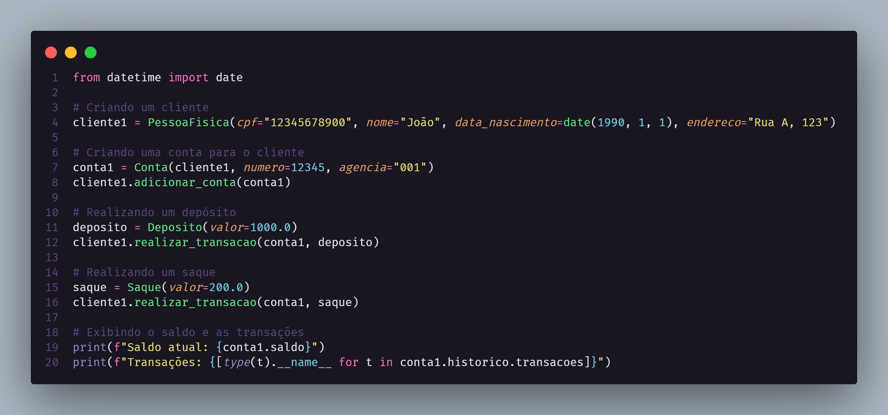

# 🏦 Sistema Bancário em Python

Este projeto é uma implementação simples de um sistema bancário em Python, usando conceitos de Programação Orientada a Objetos (POO). O sistema permite a criação de contas, depósitos, saques e exibição de extrato. As transações são registradas e armazenadas no histórico de cada conta.

## 📚 Estrutura do Projeto

O projeto está estruturado em várias classes que representam diferentes entidades e funcionalidades do sistema bancário:

### 🏗️ Classes Principais

- **Transacao**: Classe base para todas as transações.
    - `registrar(conta)`: Método abstrato para registrar uma transação em uma conta.
- **Deposito**: Subclasse de Transacao que representa um depósito.
    - `__init__(valor)`: Inicializa a transação de depósito com um valor.
    - `registrar(conta)`: Registra a transação de depósito em uma conta.
- **Saque**: Subclasse de Transacao que representa um saque.
    - `__init__(valor)`: Inicializa a transação de saque com um valor.
    - `registrar(conta)`: Registra a transação de saque em uma conta.
- **Historico**: Classe que mantém o histórico de transações de uma conta.
    - `adicionar_transacao(transacao)`: Adiciona uma transação ao histórico.
- **Conta**: Classe que representa uma conta bancária.
    - `__init__(cliente, numero, agencia)`: Inicializa a conta com cliente, número e agência.
    - `saldo()`: Retorna o saldo da conta.
    - `sacar(valor)`: Realiza um saque na conta.
    - `depositar(valor)`: Realiza um depósito na conta.
- **ContaCorrente**: Subclasse de Conta que representa uma conta corrente.
    - `__init__(cliente, numero, agencia, limite, limite_saques)`: Inicializa a conta corrente com limite de crédito e limite de saques.
- **Cliente**: Classe que representa um cliente do banco.
    - `__init__(endereco)`: Inicializa o cliente com um endereço.
    - `realizar_transacao(conta, transacao)`: Realiza uma transação em uma conta.
    - `adicionar_conta(conta)`: Adiciona uma conta ao cliente.
- **PessoaFisica**: Subclasse de Cliente que representa uma pessoa física.
    - `__init__(cpf, nome, data_nascimento, endereco)`: Inicializa a pessoa física com CPF, nome, data de nascimento e endereço.

## 📝 Exemplo de Uso

Aqui está um exemplo de como utilizar as classes para criar um cliente, uma conta, realizar depósitos e saques, e exibir o saldo e transações:

# 🔄 Funcionamento do Sistema
1. Criação do Cliente e Conta: Um cliente (Pessoa Física) é criado com um CPF, nome, data de nascimento e endereço. 

2. Em seguida, uma conta é criada e associada a este cliente.

3. Depósitos e Saques: Depósitos e saques são realizados através da criação de instâncias das classes Deposito e Saque, respectivamente, e chamando o método realizar_transacao do cliente.

4.Histórico de Transações: Todas as transações realizadas são registradas no histórico da conta, permitindo que o usuário veja todas as operações realizadas.

# 📋 Requisitos
`Python 3.x`

# 🚀 Como Executar
Clone o repositório para sua máquina local.
Navegue até o diretório do projeto.

Execute o script principal:

`python main.py`
